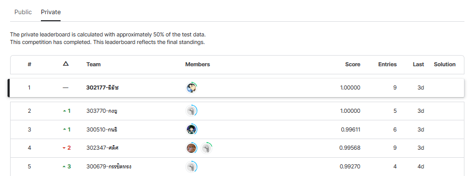

# superai3-Thai_Finger_Spelling_Recognition
Hackathon Online: Thai Finger Spelling Recognition
Hackathon Online: Thai Finger Spelling Recognition is a part of the Super AI Engineer Season 3 Online Hackathon. The objective of this hackathon is to solve an image classification problem related to finger spellingg that have 20 classes.
 

My solution for the Thai Handwritten Characters Recognition Hackathon uses the state-of-the-art model EVA02,using 10-fold training and mixup augmentation techniques on the training dataset. I am proud to say that my notebook achieved 1st place out of 23 participating teams.
 

LB score 0.99861 #1
PB score 1.00 #1
 

